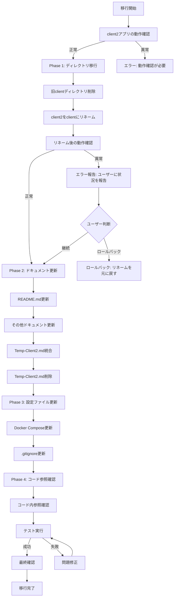

# client2アプリをclientに移行する設計書

## Overview

### 目的
既存の`client`アプリケーションを削除し、`client2`アプリケーションを`client`にリネームして移行を完了する。これにより、NextAuth (Auth.js) v5とshadcn/uiを活用したモダンな実装が正式なクライアントアプリケーションとして使用される。

### ユーザー
- **開発者**: プロジェクト構造を簡素化し、混乱を避ける
- **運用者**: 最新のドキュメントに基づいた運用が可能になる

### 影響
現在のシステム状態を以下のように変更する：
- 旧`client`ディレクトリ（Auth0、カスタムUI）を削除
- `client2`ディレクトリ（NextAuth v5、shadcn/ui）を`client`にリネーム
- すべてのドキュメントと設定ファイルを最新の実装に合わせて更新

### Goals
- 旧`client`アプリの完全な削除
- `client2`アプリの`client`へのリネーム
- ドキュメントの整合性確保（`client2`への言及を`client`に統一）
- 設定ファイルの更新（Docker Compose、`.gitignore`など）
- 移行後の動作確認とテスト実行

### Non-Goals
- 機能の追加・変更（既存のclient2アプリの機能をそのまま使用）
- バックエンドAPIの変更
- データベース構造の変更
- 新規機能の実装

## Architecture

### 移行前後の構造

#### 移行前の構造
```
go-webdb-template/
├── client/              # 旧アプリ（削除対象）
│   ├── src/
│   ├── e2e/
│   └── ...
└── client2/             # 新アプリ（リネーム対象）
    ├── app/
    ├── components/
    ├── lib/
    ├── types/
    └── ...
```

#### 移行後の構造
```
go-webdb-template/
└── client/              # リネーム後のアプリ（旧client2）
    ├── app/
    ├── components/
    ├── lib/
    ├── types/
    └── ...
```

### アーキテクチャの整合性
- **既存パターンの維持**: client2アプリの既存のアーキテクチャパターンをそのまま維持
- **技術スタックの維持**: Next.js 14+ (App Router)、NextAuth (Auth.js) v5、shadcn/ui、TypeScript 5+を維持
- **ディレクトリ構造の維持**: client2のディレクトリ構造をそのまま維持（ディレクトリ名のみ変更）

### 技術スタックの整合性
移行により技術スタックは変更されない。既存のclient2アプリの技術スタックをそのまま使用：
- **フレームワーク**: Next.js 14+ (App Router)
- **言語**: TypeScript 5+
- **UIコンポーネント**: shadcn/ui
- **認証**: NextAuth (Auth.js) v5
- **スタイリング**: Tailwind CSS
- **テスト**: Playwright (E2E), Jest (単体・統合)

## Migration Strategy

### 移行プロセス概要

移行は4つのPhaseに分けて段階的に実施する：

1. **Phase 1: ディレクトリの移行** - 削除とリネーム
2. **Phase 2: ドキュメントの更新** - README.md、その他ドキュメント、Temp-Client2.mdの統合・削除
3. **Phase 3: 設定ファイルの更新** - Docker Compose、.gitignoreなど
4. **Phase 4: コード内の参照の確認** - テスト、その他コード内の参照確認

### 移行フローチャート



### Phase別移行手順

#### Phase 1: ディレクトリの移行

**手順**:
1. **事前確認**: client2アプリが正常に動作することを確認
   - 開発サーバーの起動確認
   - 主要ページの表示確認
   - 認証機能の動作確認
2. **旧clientディレクトリの削除**: `client/`ディレクトリ全体を削除
   - Gitで管理されているため、履歴から復元可能
3. **client2ディレクトリのリネーム**: `client2/`を`client/`にリネーム
   - ファイルシステムレベルでのリネーム
   - Gitで変更を追跡
4. **動作確認**: リネーム後の動作確認
   - 開発サーバーの起動確認
   - 主要機能の動作確認

**エラー発生時の対応**:
- エラーが発生した場合、自動的にロールバックを実行せず、ユーザーに状況を報告する
- ユーザーの判断を待ち、ロールバックが必要な場合は手動で実行する

**ロールバック手順**（ユーザーが判断した場合）:
- Gitでリネームを元に戻す: `git mv client client2`
- 必要に応じて旧clientディレクトリを復元: `git checkout HEAD -- client/`

#### Phase 2: ドキュメントの更新

**手順**:
1. **README.mdの更新**
   - セットアップ手順の確認・更新
   - クライアント起動手順の確認・更新
   - `client2`への言及があれば`client`に変更
2. **docs/Temp-Client2.mdの内容統合**
   - セットアップ手順をREADME.mdに統合（重複する場合はより詳細な方を採用）
   - 技術スタック、機能説明、ディレクトリ構造などの情報を適切なドキュメントに統合
3. **その他ドキュメントの更新**
   - `docs/Partner-Idp-Auth0-Login.md`: Auth0コールバックURL設定を更新（`/auth/callback` → `/api/auth/callback/auth0`）
   - `docs/Project-Structure.md`: `client2`への言及があれば`client`に更新
   - `docs/Testing.md`: `client2`への言及があれば`client`に更新
   - `docs/Docker.md`: `client2`への言及があれば`client`に更新
   - `docs/Release-Check.md`: `client2`への言及があれば`client`に更新
   - `docs/API.md`: `client2`への言及があれば`client`に更新
4. **docs/Temp-Client2.mdの削除**
   - 内容が適切なドキュメントに統合されていることを確認後、削除

**検証ポイント**:
- すべてのドキュメントで`client`への言及が一貫していること
- Auth0コールバックURL設定が正しく更新されていること
- セットアップ手順が最新の実装と一致していること

#### Phase 3: 設定ファイルの更新

**手順**:
1. **docker-compose.client.ymlの確認・更新**
   - `context: ./client`が正しく設定されていることを確認（既に設定済みの可能性あり）
   - その他、`client2`への参照があれば`client`に変更
2. **.gitignoreの確認・更新**
   - `client/`と`client2/`の両方が記載されている場合は、`client2/`を削除
   - `client/`のエントリが適切に設定されていることを確認
3. **その他設定ファイルの確認**
   - プロジェクトルートの設定ファイルで`client2`への参照を検索
   - 必要に応じて`client`に更新

**検証ポイント**:
- Docker Composeでコンテナが正常に起動すること
- `.gitignore`が適切に設定されていること

#### Phase 4: コード内の参照の確認

**手順**:
1. **コード内のclient2参照の検索**
   - `client/`ディレクトリ内のコードで`client2`への参照を検索
   - 設定ファイル、コメント、ドキュメント内の`client2`への参照を確認
2. **参照の更新判断**
   - ディレクトリ名の変更のみで、コード内の参照は通常変更不要
   - ただし、相対パスや絶対パスで`client2`を参照している箇所があれば更新
3. **テストの実行**
   - E2Eテストの実行
   - 統合テストの実行
   - 単体テストの実行

**検証ポイント**:
- すべてのテストが正常に実行されること
- コード内に不適切な`client2`への参照がないこと

### 移行の検証チェックポイント

各Phase完了後に以下の検証を実施：

1. **Phase 1完了後**:
   - 開発サーバーが正常に起動する
   - 主要ページが正常に表示される

2. **Phase 2完了後**:
   - ドキュメントの整合性確認
   - Auth0コールバックURL設定の確認

3. **Phase 3完了後**:
   - Docker Composeでコンテナが正常に起動する
   - `.gitignore`が適切に設定されている

4. **Phase 4完了後**:
   - すべてのテストが正常に実行される
   - 最終動作確認（認証、API呼び出し、全ページ表示）

## Components and Interfaces

### Phase 1: ディレクトリ移行コンポーネント

#### ディレクトリ削除処理

**責任**:
- 旧`client`ディレクトリの安全な削除

**前提条件**:
- client2アプリが正常に動作していること
- Gitで変更がコミットされていること

**処理内容**:
- `client/`ディレクトリ全体の削除
- Git履歴の保持（必要に応じて復元可能）

**後処理**:
- リネーム処理の実行

#### ディレクトリリネーム処理

**責任**:
- `client2`ディレクトリを`client`にリネーム

**前提条件**:
- 旧`client`ディレクトリが削除されていること

**処理内容**:
- ファイルシステムレベルでのリネーム
- Gitでの変更追跡

**後処理**:
- 動作確認の実行

### Phase 2: ドキュメント更新コンポーネント

#### README.md更新処理

**責任**:
- README.mdの`client`への言及を最新の状態に更新

**更新内容**:
- セットアップ手順の確認・更新
- クライアント起動手順の確認・更新
- `client2`への言及があれば`client`に変更

#### Temp-Client2.md統合処理

**責任**:
- `docs/Temp-Client2.md`の内容を適切なドキュメントに統合

**統合先**:
- セットアップ手順 → README.md
- 技術スタック、機能説明、ディレクトリ構造 → 適切なドキュメント

**統合方針**:
- 既存のドキュメントと重複する内容は、より詳細で正確な方を採用

#### その他ドキュメント更新処理

**責任**:
- その他ドキュメントファイルの`client2`や`client`への言及を確認・更新

**更新対象**:
- `docs/Partner-Idp-Auth0-Login.md`: Auth0コールバックURL設定の更新
- `docs/Project-Structure.md`: `client2`への言及があれば`client`に更新
- `docs/Testing.md`: `client2`への言及があれば`client`に更新
- `docs/Docker.md`: `client2`への言及があれば`client`に更新
- `docs/Release-Check.md`: `client2`への言及があれば`client`に更新
- `docs/API.md`: `client2`への言及があれば`client`に更新

**特別な注意事項**:
- `docs/Partner-Idp-Auth0-Login.md`のAuth0コールバックURL設定を必ず更新（`/auth/callback` → `/api/auth/callback/auth0`）

### Phase 3: 設定ファイル更新コンポーネント

#### Docker Compose更新処理

**責任**:
- Docker Compose設定ファイルで`client`ディレクトリを参照するように更新

**更新内容**:
- `docker-compose.client.yml`の`context: ./client`が正しく設定されていることを確認
- その他、Docker Composeファイルで`client2`への参照があれば`client`に変更

#### .gitignore更新処理

**責任**:
- `.gitignore`で`client2`への参照を削除

**更新内容**:
- `client/`と`client2/`の両方が記載されている場合は、`client2/`を削除
- `client/`のエントリが適切に設定されていることを確認

### Phase 4: コード参照確認コンポーネント

#### コード参照検索処理

**責任**:
- コード内で`client2`への不適切な参照がないか確認

**検索対象**:
- `client/`ディレクトリ内のコード
- 設定ファイル、コメント、ドキュメント内の参照

**更新判断**:
- ディレクトリ名の変更のみで、コード内の参照は通常変更不要
- ただし、相対パスや絶対パスで`client2`を参照している箇所があれば更新

## Error Handling

### エラー戦略

移行作業中に発生する可能性のあるエラーとその対応方法を定義する。

### エラーカテゴリと対応

#### ディレクトリ操作エラー

**エラー種別**: ファイルシステムエラー、権限エラー

**発生タイミング**: Phase 1（ディレクトリ削除・リネーム時）

**対応方法**:
- ファイルシステムの権限を確認
- Gitの状態を確認（未コミットの変更がないか）
- 必要に応じて手動で操作を実行
- **重要**: 自動的にロールバックを実行せず、ユーザーに状況を報告し、ロールバックの実行を確認する

**ロールバック手順**（ユーザーが判断した場合）:
- Gitでリネームを元に戻す
- 必要に応じて旧clientディレクトリを復元

#### ドキュメント整合性エラー

**エラー種別**: ドキュメントの不整合、参照エラー

**発生タイミング**: Phase 2（ドキュメント更新時）

**対応方法**:
- すべてのドキュメントで`client`への言及が一貫していることを確認
- Auth0コールバックURL設定が正しく更新されていることを確認
- セットアップ手順が最新の実装と一致していることを確認

**修正方法**:
- 不整合が見つかった場合は該当ドキュメントを修正
- 参照エラーが見つかった場合は参照先を修正
- **重要**: 自動的にロールバックを実行せず、ユーザーに状況を報告し、修正方法を確認する

**ロールバック手順**（ユーザーが判断した場合）:
- Gitでドキュメントの変更を元に戻す

#### 設定ファイルエラー

**エラー種別**: Docker Compose設定エラー、.gitignore設定エラー

**発生タイミング**: Phase 3（設定ファイル更新時）

**対応方法**:
- Docker Composeでコンテナが正常に起動することを確認
- `.gitignore`が適切に設定されていることを確認

**修正方法**:
- Docker Compose設定を修正
- `.gitignore`を修正
- **重要**: 自動的にロールバックを実行せず、ユーザーに状況を報告し、修正方法を確認する

**ロールバック手順**（ユーザーが判断した場合）:
- Gitで設定ファイルの変更を元に戻す

#### テスト実行エラー

**エラー種別**: テスト失敗、パス参照エラー

**発生タイミング**: Phase 4（テスト実行時）

**対応方法**:
- テストファイル内のパス参照を確認
- 必要に応じてパス参照を修正
- テストが正常に実行されることを確認

**修正方法**:
- テストファイル内のパス参照を修正
- テストコードを修正
- **重要**: 自動的にロールバックを実行せず、ユーザーに状況を報告し、修正方法を確認する

**ロールバック手順**（ユーザーが判断した場合）:
- Gitでコードの変更を元に戻す

### モニタリング

移行作業中のモニタリング項目：

1. **Phase 1**: ディレクトリ操作の成功/失敗
2. **Phase 2**: ドキュメント更新の整合性
3. **Phase 3**: 設定ファイルの整合性
4. **Phase 4**: テスト実行結果

各Phase完了後に検証チェックポイントで動作確認を実施し、問題があればユーザーに状況を報告し、対応方法を確認する。自動的にロールバックを実行することはない。

## Testing Strategy

### テスト方針

移行作業は既存の機能をそのまま使用するため、新規のテスト実装は不要。既存のテストを実行して動作確認を行う。

### テスト種別

#### Phase 1完了後のテスト

**目的**: ディレクトリリネーム後の動作確認

**テスト内容**:
- 開発サーバーの起動確認
- 主要ページの表示確認
- 認証機能の動作確認

**実行方法**:
- 手動での動作確認

#### Phase 4完了後のテスト

**目的**: 移行完了後の包括的な動作確認

**テスト内容**:
1. **E2Eテスト（Playwright）**
   - 認証フロー（`auth-flow.spec.ts`）
   - ユーザー管理フロー（`user-flow.spec.ts`）
   - 投稿管理フロー（`post-flow.spec.ts`）
   - クロスシャードクエリフロー（`cross-shard.spec.ts`）
   - メール送信フロー（`email-send.spec.ts`）
   - CSVダウンロードフロー（`csv-download.spec.ts`）

2. **統合テスト（Jest）**
   - ユーザー管理ページ（`users-page.test.tsx`）
   - ジョブキューページ（`dm-jobqueue-page.test.tsx`）

3. **単体テスト（Jest）**
   - TodayApiButtonコンポーネント（`TodayApiButton.test.tsx`）
   - APIクライアント（`api.test.ts`）

**実行方法**:
```bash
# E2Eテスト
cd client
npm run e2e

# 統合・単体テスト
cd client
npm test
```

### 最終確認項目

移行完了後の最終確認：

1. **開発サーバーの起動確認**
   - `cd client && npm run dev`で正常に起動することを確認

2. **すべてのページの表示確認**
   - トップページ
   - ユーザー管理ページ
   - 投稿管理ページ
   - ユーザーと投稿のJOINページ
   - メール送信ページ
   - 動画アップロードページ
   - ジョブキューページ

3. **認証機能の動作確認**
   - ログイン機能
   - ログアウト機能
   - 認証トークンの取得
   - プロフィール取得

4. **API呼び出しの動作確認**
   - すべてのAPIエンドポイントが正常に動作することを確認

5. **Docker環境での動作確認**
   - `docker-compose -f docker-compose.client.yml up -d`でコンテナが正常に起動することを確認

## Security Considerations

### セキュリティへの影響

移行作業は既存の機能をそのまま使用するため、セキュリティへの影響は最小限。

### 確認事項

1. **認証設定の確認**
   - NextAuth (Auth.js) v5の設定が正しく動作することを確認
   - Auth0コールバックURL設定が正しく更新されていることを確認

2. **環境変数の確認**
   - 環境変数の設定が正しく動作することを確認
   - 機密情報が適切に管理されていることを確認

3. **API認証の確認**
   - API呼び出し時の認証トークンが正しく取得・送信されることを確認

## Migration Strategy

### 移行フェーズ詳細

移行は4つのPhaseに分けて段階的に実施する。各Phaseは独立して実行可能だが、推奨順序に従って実施する。

### Phase 1: ディレクトリの移行

**目的**: 旧`client`ディレクトリを削除し、`client2`を`client`にリネーム

**実行手順**:
1. client2アプリの動作確認
2. 旧clientディレクトリの削除
3. client2ディレクトリのリネーム
4. リネーム後の動作確認

**検証**:
- 開発サーバーが正常に起動する
- 主要ページが正常に表示される

**ロールバック**:
- Gitでリネームを元に戻す
- 必要に応じて旧clientディレクトリを復元

### Phase 2: ドキュメントの更新

**目的**: すべてのドキュメントを最新の実装に合わせて更新

**実行手順**:
1. README.mdの更新
2. docs/Temp-Client2.mdの内容統合
3. その他ドキュメントの更新
4. docs/Temp-Client2.mdの削除

**検証**:
- すべてのドキュメントで`client`への言及が一貫している
- Auth0コールバックURL設定が正しく更新されている
- セットアップ手順が最新の実装と一致している

**エラー発生時の対応**:
- エラーが発生した場合、自動的にロールバックを実行せず、ユーザーに状況を報告する
- ユーザーの判断を待ち、ロールバックが必要な場合は手動で実行する

**ロールバック手順**（ユーザーが判断した場合）:
- Gitでドキュメントの変更を元に戻す

### Phase 3: 設定ファイルの更新

**目的**: Docker Compose、.gitignoreなどの設定ファイルを更新

**実行手順**:
1. docker-compose.client.ymlの確認・更新
2. .gitignoreの確認・更新
3. その他設定ファイルの確認

**検証**:
- Docker Composeでコンテナが正常に起動する
- .gitignoreが適切に設定されている

**エラー発生時の対応**:
- エラーが発生した場合、自動的にロールバックを実行せず、ユーザーに状況を報告する
- ユーザーの判断を待ち、ロールバックが必要な場合は手動で実行する

**ロールバック手順**（ユーザーが判断した場合）:
- Gitで設定ファイルの変更を元に戻す

### Phase 4: コード内の参照の確認

**目的**: コード内で`client2`への不適切な参照がないか確認

**実行手順**:
1. コード内のclient2参照の検索
2. 参照の更新判断
3. テストの実行

**検証**:
- すべてのテストが正常に実行される
- コード内に不適切な`client2`への参照がない

**エラー発生時の対応**:
- エラーが発生した場合、自動的にロールバックを実行せず、ユーザーに状況を報告する
- ユーザーの判断を待ち、ロールバックが必要な場合は手動で実行する

**ロールバック手順**（ユーザーが判断した場合）:
- Gitでコードの変更を元に戻す

### 移行の検証チェックポイント

各Phase完了後に以下の検証を実施：

1. **Phase 1完了後**: 開発サーバーの起動確認、主要ページの表示確認
2. **Phase 2完了後**: ドキュメントの整合性確認、Auth0コールバックURL設定の確認
3. **Phase 3完了後**: Docker Composeでコンテナが正常に起動する、.gitignoreが適切に設定されている
4. **Phase 4完了後**: すべてのテストが正常に実行される、最終動作確認（認証、API呼び出し、全ページ表示）

### ロールバック戦略

**重要**: 異常が発生した場合、自動的にロールバックを実行せず、必ずユーザーに状況を報告し、ロールバックの実行を確認してから実施する。

各Phaseで問題が発生した場合の対応手順：

1. **エラー検出**: 各Phaseの検証チェックポイントで問題を検出
2. **状況報告**: ユーザーにエラーの内容と影響範囲を報告
3. **ユーザー判断**: ユーザーにロールバックの必要性を判断してもらう
4. **ロールバック実行**（ユーザーが判断した場合のみ）:
   - **Phase 1**: Gitでリネームを元に戻す、必要に応じて旧clientディレクトリを復元
   - **Phase 2**: Gitでドキュメントの変更を元に戻す
   - **Phase 3**: Gitで設定ファイルの変更を元に戻す
   - **Phase 4**: Gitでコードの変更を元に戻す

すべての変更はGitで管理されているため、必要に応じて履歴から復元可能。ロールバックはユーザーの明示的な判断に基づいてのみ実行する。
