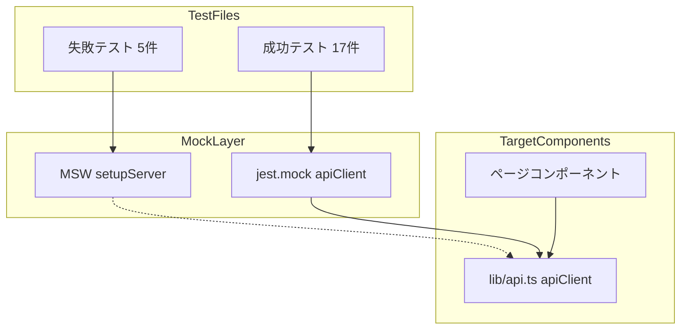
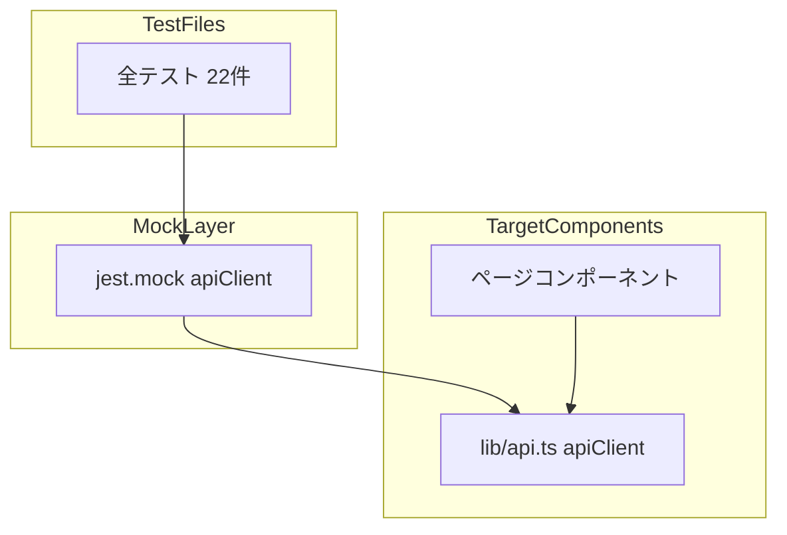

# Technical Design Document

## Overview

**Purpose**: クライアントテストの実行時に発生するMSW依存のESMエラーを解決し、全テストが正常に実行できるようにする。

**Users**: 開発者がテストを実行する際に、エラーなく全テストが成功する状態を提供する。

**Impact**: 5件の失敗テストファイルのモック方式を変更し、既存の成功テストと同じパターンに統一する。

### Goals
- 5件の失敗テストを `jest.mock` 方式に変更して正常に実行できるようにする
- 元のテストケースと同等のテストカバレッジを維持する
- 既存の成功テストに影響を与えない

### Non-Goals
- Jest設定ファイル（`jest.config.js`、`jest.setup.js`）の変更
- MSWライブラリの使用継続
- テストケースの削減や簡略化

## Architecture

### Existing Architecture Analysis

現在のテスト構造:
- **成功テスト（17件）**: `jest.mock('@/lib/api', ...)` でAPIクライアントをモック
- **失敗テスト（5件）**: `msw/node` の `setupServer` でHTTPリクエストをモック

失敗の原因:
- MSWの依存パッケージ `until-async` がESM形式の `export` 文を使用
- Jestがこの形式を解析できず `SyntaxError: Unexpected token 'export'` が発生

### Architecture Pattern & Boundary Map



**修正後のアーキテクチャ:**



**Architecture Integration**:
- Selected pattern: `jest.mock` による依存性注入パターン
- Domain/feature boundaries: テストファイルごとにモックを独立して定義
- Existing patterns preserved: 成功テストで使用されている `jest.mock` パターンをそのまま適用
- New components rationale: 新規コンポーネントは追加しない
- Steering compliance: テスト戦略（Jest + React Testing Library）に準拠

### Technology Stack

| Layer | Choice / Version | Role in Feature | Notes |
|-------|------------------|-----------------|-------|
| Testing | Jest + React Testing Library | テスト実行、コンポーネントレンダリング | 既存のまま |
| Mocking | jest.mock, jest.fn | APIクライアントのモック | MSWから変更 |

## Requirements Traceability

| Requirement | Summary | Components | Interfaces | Flows |
|-------------|---------|------------|------------|-------|
| 1.1 | 全テストがエラーなく実行される | 5件のテストファイル | jest.mock | - |
| 1.2 | 成功テストと同じモック方式を使用 | 5件のテストファイル | apiClient mock | - |
| 1.3 | 元のテストケースをカバー | 5件のテストファイル | - | 各テストシナリオ |
| 1.4 | 一貫したコーディングスタイル | 5件のテストファイル | - | - |
| 2.1 | テストケースカバレッジ維持 | 5件のテストファイル | - | テストケース |
| 2.2 | ナビゲーションリンクテスト維持 | 該当テストファイル | - | - |
| 2.3 | モックデータ構造維持 | 5件のテストファイル | mock data | - |
| 3.1 | 既存成功テストが引き続き成功 | - | - | - |
| 3.2 | 共通設定ファイルを変更しない | - | - | - |
| 3.3 | 全22件のテストが成功 | 全テストファイル | - | - |

## Components and Interfaces

| Component | Domain/Layer | Intent | Req Coverage | Key Dependencies | Contracts |
|-----------|--------------|--------|--------------|------------------|-----------|
| dm-email-send-page.test.tsx | Test | メール送信ページのテスト | 1.1-1.4, 2.1-2.3 | apiClient.sendEmail | Service |
| dm-posts-page.test.tsx | Test | 投稿管理ページのテスト | 1.1-1.4, 2.1-2.3 | apiClient.getDmPosts, getDmUsers, createDmPost | Service |
| dm-jobqueue-page.test.tsx | Test | ジョブキューページのテスト | 1.1-1.4, 2.1-2.3 | apiClient.registerJob | Service |
| users-page.test.tsx | Test | ユーザー管理ページのテスト | 1.1-1.4, 2.1-2.3 | apiClient.getDmUsers, createDmUser | Service |
| dm-user-posts-page.test.tsx | Test | ユーザー投稿JOINページのテスト | 1.1-1.4, 2.1-2.3 | apiClient.getDmUserPosts | Service |

### Test Layer

#### dm-email-send-page.test.tsx

| Field | Detail |
|-------|--------|
| Intent | メール送信ページの表示とフォーム送信をテスト |
| Requirements | 1.1, 1.2, 1.3, 1.4, 2.1 |

**Responsibilities & Constraints**
- ページタイトル表示の確認
- フォーム入力とバリデーション
- API成功/エラー時の動作確認
- ローディング状態の確認

**Dependencies**
- Inbound: SendEmailPage — テスト対象 (P0)
- External: apiClient.sendEmail — モック対象 (P0)

**Contracts**: Service [x]

##### Service Interface
```typescript
// モック定義
const mockSendEmail = jest.fn()

jest.mock('@/lib/api', () => ({
  apiClient: {
    sendEmail: (...args: unknown[]) => mockSendEmail(...args),
  },
}))

// 使用パターン
mockSendEmail.mockResolvedValue({ success: true, message: 'メールを送信しました' })
mockSendEmail.mockRejectedValue(new Error('Internal Server Error'))
```

**Implementation Notes**
- MSWの `setupServer` と `http.post` を削除
- `beforeAll`, `afterAll` のサーバー起動/停止処理を削除
- `beforeEach` で `jest.clearAllMocks()` を呼び出し
- テストケース内で `server.use()` を使用していた箇所は `mockSendEmail.mockRejectedValue()` に変更

---

#### dm-posts-page.test.tsx

| Field | Detail |
|-------|--------|
| Intent | 投稿管理ページの一覧表示、作成、削除をテスト |
| Requirements | 1.1, 1.2, 1.3, 1.4, 2.1, 2.2 |

**Responsibilities & Constraints**
- 投稿一覧の表示確認
- 新規投稿作成フォーム
- API成功/エラー時の動作確認
- ローディング状態と空状態の確認

**Dependencies**
- Inbound: PostsPage — テスト対象 (P0)
- External: apiClient.getDmPosts, getDmUsers, createDmPost, deleteDmPost — モック対象 (P0)

**Contracts**: Service [x]

##### Service Interface
```typescript
const mockGetDmPosts = jest.fn()
const mockGetDmUsers = jest.fn()
const mockCreateDmPost = jest.fn()
const mockDeleteDmPost = jest.fn()

jest.mock('@/lib/api', () => ({
  apiClient: {
    getDmPosts: (...args: unknown[]) => mockGetDmPosts(...args),
    getDmUsers: (...args: unknown[]) => mockGetDmUsers(...args),
    createDmPost: (...args: unknown[]) => mockCreateDmPost(...args),
    deleteDmPost: (...args: unknown[]) => mockDeleteDmPost(...args),
  },
}))
```

**Implementation Notes**
- `mockPosts` と `mockUsers` のデータ構造は維持
- `afterEach` でのデータリセットは `jest.clearAllMocks()` で代替
- 動的なモックデータ更新（`mockPosts = [...mockPosts, newPost]`）はテストケース内で `mockGetDmPosts.mockResolvedValue()` を再設定

---

#### dm-jobqueue-page.test.tsx

| Field | Detail |
|-------|--------|
| Intent | ジョブキュー登録ページの表示と登録処理をテスト |
| Requirements | 1.1, 1.2, 1.3, 1.4, 2.1 |

**Responsibilities & Constraints**
- ジョブ登録フォームの表示確認
- ジョブ登録成功/エラー時の動作確認
- カスタムメッセージ入力の確認

**Dependencies**
- Inbound: DmJobqueuePage — テスト対象 (P0)
- External: apiClient.registerJob — モック対象 (P0)

**Contracts**: Service [x]

##### Service Interface
```typescript
const mockRegisterJob = jest.fn()

jest.mock('@/lib/api', () => ({
  apiClient: {
    registerJob: (...args: unknown[]) => mockRegisterJob(...args),
  },
}))
```

---

#### users-page.test.tsx

| Field | Detail |
|-------|--------|
| Intent | ユーザー管理ページの一覧表示と作成をテスト |
| Requirements | 1.1, 1.2, 1.3, 1.4, 2.1 |

**Responsibilities & Constraints**
- ユーザー一覧の表示確認
- 新規ユーザー作成フォーム
- API成功/エラー時の動作確認
- ローディング状態の確認

**Dependencies**
- Inbound: UsersPage — テスト対象 (P0)
- External: apiClient.getDmUsers, createDmUser, deleteDmUser — モック対象 (P0)

**Contracts**: Service [x]

##### Service Interface
```typescript
const mockGetDmUsers = jest.fn()
const mockCreateDmUser = jest.fn()
const mockDeleteDmUser = jest.fn()

jest.mock('@/lib/api', () => ({
  apiClient: {
    getDmUsers: (...args: unknown[]) => mockGetDmUsers(...args),
    createDmUser: (...args: unknown[]) => mockCreateDmUser(...args),
    deleteDmUser: (...args: unknown[]) => mockDeleteDmUser(...args),
  },
}))
```

---

#### dm-user-posts-page.test.tsx

| Field | Detail |
|-------|--------|
| Intent | ユーザーと投稿のJOIN結果表示ページをテスト |
| Requirements | 1.1, 1.2, 1.3, 1.4, 2.1, 2.2 |

**Responsibilities & Constraints**
- JOIN結果の表示確認
- シャーディング情報の表示確認
- API成功/エラー時の動作確認
- ローディング状態と空状態の確認

**Dependencies**
- Inbound: UserPostsPage — テスト対象 (P0)
- External: apiClient.getDmUserPosts — モック対象 (P0)

**Contracts**: Service [x]

##### Service Interface
```typescript
const mockGetDmUserPosts = jest.fn()

jest.mock('@/lib/api', () => ({
  apiClient: {
    getDmUserPosts: (...args: unknown[]) => mockGetDmUserPosts(...args),
  },
}))
```

## Testing Strategy

### Unit Tests
- 各テストファイルの修正後、個別にテストを実行して成功を確認

### Integration Tests
1. `npm run test:client` で全22件のテストが成功することを確認
2. 既存の成功テスト17件が引き続き成功することを確認
3. 修正した5件のテストが新たに成功することを確認

### Test Case Mapping（修正前後のテストケース対応）

| テストファイル | 修正前テストケース数 | 修正後テストケース数 |
|---------------|-------------------|-------------------|
| dm-email-send-page.test.tsx | 6 | 6 |
| dm-posts-page.test.tsx | 8 | 8 |
| dm-jobqueue-page.test.tsx | 4 | 4 |
| users-page.test.tsx | 4 | 4 |
| dm-user-posts-page.test.tsx | 8 | 8 |
| **合計** | **30** | **30** |

## Error Handling

### Error Strategy
- モックの `mockRejectedValue` を使用してAPIエラーをシミュレート
- テストケースでエラーメッセージの表示を確認

### Error Categories and Responses
- **API Errors (5xx)**: `mockRejectedValue(new Error('Internal Server Error'))` でシミュレート
- **Service Unavailable (503)**: `mockRejectedValue(new Error('Service Unavailable'))` でシミュレート
