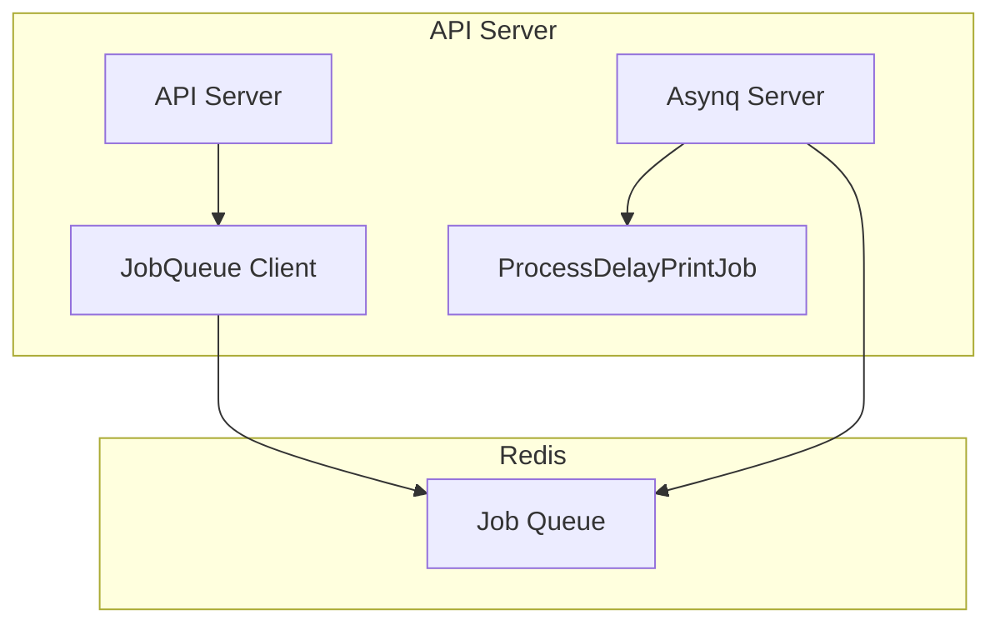
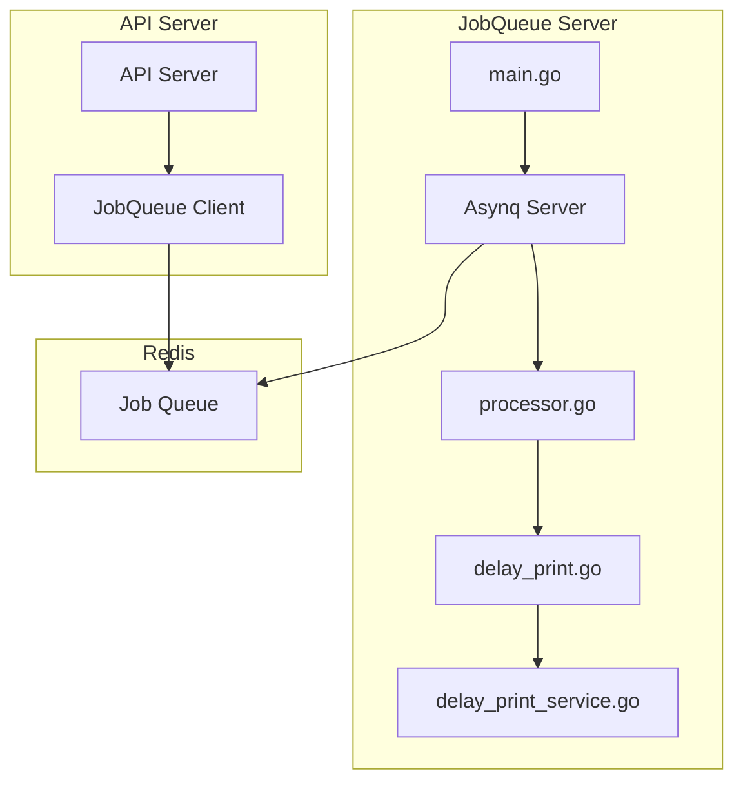

# Technical Design Document

## Overview

**Purpose**: ジョブの消化処理のみを担当する独立したJobQueueサーバーを作成し、APIサーバーからジョブの消化処理を分離する。

**Users**: 開発者がジョブ処理サーバーを独立して起動・停止・スケールアウトできるようにする。

**Impact**: APIサーバーとJobQueueサーバーの責務が明確に分離され、ジョブ処理サーバーを独立してスケールアウト可能になる。

### Goals
- JobQueueサーバー（`server/cmd/jobqueue`）の作成
- ジョブ処理フローの実装（processor → usecase → service）
- APIサーバーからのジョブ消化処理の削除
- Redis接続の堅牢性の実装

### Non-Goals
- 新しいジョブタイプの追加（現時点では標準出力への文字列出力のみ）
- ジョブ処理の最適化
- ジョブ処理の監視機能
- ジョブ処理のメトリクス収集
- ジョブ処理の優先度制御
- ジョブ処理の並列度制御（既存の設定を維持）

## Architecture

### Existing Architecture Analysis

現在のアーキテクチャ:
- **APIサーバー**: ジョブの登録と消化処理の両方を担当
  - `server/cmd/server/main.go`: Asynqサーバーを起動（102-120行目）
  - `server/internal/service/jobqueue/server.go`: Asynqサーバーの実装
  - `server/internal/service/jobqueue/processor.go`: ジョブ処理の実装（`ProcessDelayPrintJob`）
- **ジョブ登録**: APIサーバー経由でジョブをRedisに登録
- **ジョブ消化**: APIサーバー内でAsynqサーバーを起動して処理

課題:
- APIサーバーとジョブ処理サーバーの責務が混在
- ジョブ処理のスケールアウトがAPIサーバーと連動
- リソース競合の可能性

### Architecture Pattern & Boundary Map

**修正前のアーキテクチャ:**



**修正後のアーキテクチャ:**



**Architecture Integration**:
- Selected pattern: レイヤードアーキテクチャ（processor → usecase → service）
- Domain/feature boundaries: JobQueueサーバーを独立したプロセスとして分離
- Existing patterns preserved: 既存のAsynqサーバー実装を再利用
- New components rationale: ジョブ処理をレイヤードアーキテクチャに従って実装
- Steering compliance: 既存のレイヤードアーキテクチャパターンに準拠

### Technology Stack

| Layer | Choice / Version | Role in Feature | Notes |
|-------|------------------|-----------------|-------|
| Language | Go 1.23.4 | サーバー実装 | 既存のまま |
| Job Queue | Asynq v0.25.1 | ジョブキュー処理 | 既存のまま |
| Redis | go-redis/v9 | Redis接続 | 既存のまま |
| Config | viper | 設定管理 | 既存のまま |

## Requirements Traceability

| Requirement | Summary | Components | Interfaces | Flows |
|-------------|---------|------------|------------|-------|
| 3.1.1 | JobQueueサーバーの作成 | main.go | - | Server startup |
| 3.1.2 | 設定ファイルの使用 | main.go, config | config.Load() | Config loading |
| 3.1.3 | Redis接続の堅牢性 | server.go | Redis client | Error handling |
| 3.2.1 | ジョブ処理フローの実装 | processor.go, delay_print.go, delay_print_service.go | - | Job processing |
| 3.3.1 | 既存ジョブタイプ定数の使用 | constants.go | JobTypeDelayPrint | Job registration |
| 3.4.1 | 標準出力への文字列出力処理 | delay_print.go, delay_print_service.go | - | Job execution |
| 3.5.1 | APIサーバーからのジョブ消化処理の削除 | server/main.go | - | Server cleanup |

## Components and Interfaces

| Component | Domain/Layer | Intent | Req Coverage | Key Dependencies | Contracts |
|-----------|--------------|--------|--------------|------------------|-----------|
| server/cmd/jobqueue/main.go | Entry Point | JobQueueサーバーのエントリーポイント | 3.1.1, 3.1.2, 3.1.3 | config, jobqueue.Server | - |
| server/internal/service/jobqueue/server.go | Service | Asynqサーバーの実装 | 3.1.1, 3.1.3 | asynq, redis | - |
| server/internal/service/jobqueue/processor.go | Service | 入出力制御とusecase層の呼び出し | 3.2.1 | asynq, usecase | Usecase |
| server/internal/usecase/jobqueue/delay_print.go | Usecase | ビジネスロジック | 3.2.1, 3.4.1 | service | Service |
| server/internal/service/delay_print_service.go | Service | ビジネスユーティリティロジック | 3.2.1, 3.4.1 | - | - |
| server/internal/service/jobqueue/constants.go | Service | ジョブタイプ定数 | 3.3.1 | - | - |

### Entry Point Layer

#### server/cmd/jobqueue/main.go

| Field | Detail |
|-------|--------|
| Intent | JobQueueサーバーのエントリーポイント。設定読み込み、サーバー起動、Graceful shutdownを実装 |
| Requirements | 3.1.1, 3.1.2, 3.1.3 |

**Responsibilities & Constraints**
- 設定ファイルの読み込み（`config.Load()`）
- Asynqサーバーの初期化と起動
- ジョブ処理の登録
- Graceful shutdownの実装（SIGINT、SIGTERM）
- Redis接続エラーハンドリング（起動時エラーでも停止しない）

**Dependencies**
- Inbound: なし（エントリーポイント）
- External: `config.Load()`, `jobqueue.NewServer()`, `jobqueue.Server.Start()`, `jobqueue.Server.Shutdown()`

**Contracts**: Service [x]

##### Implementation Structure
```go
func main() {
    // 1. 設定ファイルの読み込み
    cfg, err := config.Load()
    
    // 2. Asynqサーバーの初期化（Redis接続エラーでも継続）
    jobQueueServer, err := jobqueue.NewServer(cfg)
    if err != nil {
        log.Printf("WARNING: Failed to create job queue server: %v", err)
        // エラーでも起動を継続
    }
    
    // 3. サーバー起動（バックグラウンド）
    go func() {
        if err := jobQueueServer.Start(); err != nil {
            log.Printf("ERROR: Failed to start job queue server: %v", err)
        }
    }()
    
    // 4. Graceful shutdown
    quit := make(chan os.Signal, 1)
    signal.Notify(quit, syscall.SIGINT, syscall.SIGTERM)
    <-quit
    
    // 5. サーバー停止
    if jobQueueServer != nil {
        jobQueueServer.Shutdown()
    }
}
```

**Implementation Notes**
- 既存の`server/cmd/server/main.go`を参考に実装
- Redis接続エラー時もサーバーを停止しない（警告ログを出力）
- Graceful shutdownを実装（30秒のタイムアウト）

---

### Service Layer

#### server/internal/service/jobqueue/server.go

| Field | Detail |
|-------|--------|
| Intent | Asynqサーバーをラップする構造体。ジョブハンドラーの登録を担当 |
| Requirements | 3.1.1, 3.1.3 |

**Responsibilities & Constraints**
- Asynqサーバーの初期化
- Redis接続の設定
- ジョブハンドラーの登録（`JobTypeDelayPrint`）
- サーバーの起動と停止

**Dependencies**
- Inbound: `config.Config`
- External: `asynq`, `redis`

**Contracts**: Service [x]

##### Implementation Structure
```go
type Server struct {
    server *asynq.Server
    mux    *asynq.ServeMux
}

func NewServer(cfg *config.Config) (*Server, error) {
    // Redis接続設定
    redisOpts := buildRedisOptions(&cfg.CacheServer.Redis.JobQueue, redisAddr)
    redisClient := redis.NewClient(redisOpts)
    
    // Asynqサーバーの作成
    srv := asynq.NewServerFromRedisClient(redisClient, asynq.Config{
        Concurrency: 10,
        Queues: map[string]int{"default": 10},
    })
    
    // ジョブハンドラーの登録
    mux := asynq.NewServeMux()
    mux.HandleFunc(JobTypeDelayPrint, ProcessDelayPrintJob)
    
    return &Server{server: srv, mux: mux}, nil
}
```

**Implementation Notes**
- 既存の実装をそのまま使用（変更不要）
- Redis接続エラーは呼び出し元で処理

---

#### server/internal/service/jobqueue/processor.go

| Field | Detail |
|-------|--------|
| Intent | 入出力制御とusecase層の呼び出し。ジョブのペイロード解析とバリデーションを担当 |
| Requirements | 3.2.1 |

**Responsibilities & Constraints**
- ジョブのペイロードの解析（JSON）
- ペイロードのバリデーション
- usecase層の呼び出し
- エラーハンドリング

**Dependencies**
- Inbound: `asynq.Task`
- External: `usecase/jobqueue`

**Contracts**: Usecase [x]

##### Implementation Structure
```go
func ProcessDelayPrintJob(ctx context.Context, t *asynq.Task) error {
    // 1. ペイロードの解析
    var payload DelayPrintPayload
    if err := json.Unmarshal(t.Payload(), &payload); err != nil {
        return fmt.Errorf("failed to unmarshal payload: %w", err)
    }
    
    // 2. usecase層の呼び出し
    usecase := usecasejobqueue.NewDelayPrintUsecase(...)
    return usecase.Execute(ctx, &payload)
}
```

**Implementation Notes**
- 既存の`ProcessDelayPrintJob`を修正してusecase層を呼び出すように変更
- ペイロードの解析とバリデーションはprocessor層で実施
- usecase層への依存を注入

---

#### server/internal/service/delay_print_service.go

| Field | Detail |
|-------|--------|
| Intent | ビジネスユーティリティロジック。標準出力への文字列出力を実装 |
| Requirements | 3.2.1, 3.4.1 |

**Responsibilities & Constraints**
- 標準出力への文字列出力
- タイムスタンプの付与
- バッファのフラッシュ

**Dependencies**
- Inbound: `DelayPrintPayload`
- External: `os`, `time`

**Contracts**: Service [x]

##### Implementation Structure
```go
type DelayPrintService struct {
    // 必要に応じて依存関係を追加
}

func (s *DelayPrintService) PrintMessage(message string) error {
    timestamp := time.Now().Format("2006-01-02 15:04:05")
    fmt.Printf("[%s] %s\n", timestamp, message)
    os.Stdout.Sync() // バッファをフラッシュ
    return nil
}
```

**Implementation Notes**
- 既存の`ProcessDelayPrintJob`の処理ロジックを移行
- レイヤードアーキテクチャに従って実装

---

### Usecase Layer

#### server/internal/usecase/jobqueue/delay_print.go

| Field | Detail |
|-------|--------|
| Intent | ビジネスロジック。サービス層を呼び出して処理を実現する |
| Requirements | 3.2.1, 3.4.1 |

**Responsibilities & Constraints**
- サービス層の呼び出し
- ビジネスロジックの実装
- エラーハンドリング

**Dependencies**
- Inbound: `DelayPrintPayload`
- External: `service/delay_print_service`

**Contracts**: Service [x]

##### Implementation Structure
```go
type DelayPrintUsecase struct {
    service *delayprintservice.DelayPrintService
}

func NewDelayPrintUsecase(service *delayprintservice.DelayPrintService) *DelayPrintUsecase {
    return &DelayPrintUsecase{service: service}
}

func (u *DelayPrintUsecase) Execute(ctx context.Context, payload *DelayPrintPayload) error {
    // デフォルトメッセージの設定
    message := payload.Message
    if message == "" {
        message = "Job executed successfully"
    }
    
    // サービス層の呼び出し
    return u.service.PrintMessage(message)
}
```

**Implementation Notes**
- 既存のレイヤードアーキテクチャパターンに従う
- サービス層への依存を注入
- ビジネスロジック（デフォルト値の設定など）を実装

---

## Data Flow

### Job Processing Flow

```
1. Redisからジョブ取得
   └─> Asynq Server (server.go)
       └─> ジョブタイプを特定 (JobTypeDelayPrint)

2. 入出力制御とusecase層の呼び出し
   └─> Processor (processor.go)
       └─> ペイロード解析 (JSON)
       └─> バリデーション
       └─> Usecase呼び出し

3. ビジネスロジックの実行
   └─> Usecase (delay_print.go)
       └─> デフォルト値の設定
       └─> Service呼び出し

4. ビジネスユーティリティロジックの実行
   └─> Service (delay_print_service.go)
       └─> 標準出力への文字列出力
       └─> タイムスタンプ付与
       └─> バッファフラッシュ
```

### Job Registration Flow (Unchanged)

```
API Server
  └─> DmJobqueueUsecase
      └─> JobQueueClient
          └─> Redis (Job Queue)
```

## Error Handling

### Redis Connection Errors

**起動時のエラー**:
- Redis接続エラーが発生しても、JobQueueサーバーは停止しない
- 警告ログを出力して起動を継続
- Redis接続が復旧した場合、処理を自動的に再開

**実装**:
```go
jobQueueServer, err := jobqueue.NewServer(cfg)
if err != nil {
    log.Printf("WARNING: Failed to create job queue server: %v", err)
    log.Printf("WARNING: Job queue processing will be unavailable until Redis is started")
    // エラーでも起動を継続
}
```

### Job Processing Errors

**ペイロード解析エラー**:
- JSON解析エラーはprocessor層で処理
- エラーを返すとAsynqがリトライを実行

**サービス層エラー**:
- サービス層のエラーはusecase層で処理
- エラーを返すとprocessor層に伝播

### Graceful Shutdown

**シグナル処理**:
- SIGINT、SIGTERMを受信した場合、Graceful shutdownを実行
- 処理中のジョブは完了まで待機
- 30秒のタイムアウトを設定

**実装**:
```go
quit := make(chan os.Signal, 1)
signal.Notify(quit, syscall.SIGINT, syscall.SIGTERM)
<-quit

if jobQueueServer != nil {
    jobQueueServer.Shutdown()
}
```

## Testing Strategy

### Unit Tests

**対象コンポーネント**:
- `server/internal/usecase/jobqueue/delay_print.go`
- `server/internal/service/delay_print_service.go`
- `server/internal/service/jobqueue/processor.go`

**テスト内容**:
- ペイロード解析のテスト
- デフォルト値の設定テスト
- サービス層の呼び出しテスト
- エラーハンドリングのテスト

### Integration Tests

**対象コンポーネント**:
- `server/cmd/jobqueue/main.go`
- ジョブ処理フロー全体

**テスト内容**:
- JobQueueサーバーの起動テスト
- ジョブ処理の統合テスト
- Redis接続エラーのテスト
- Graceful shutdownのテスト

### Test Files

| File | Type | Coverage |
|------|------|----------|
| `server/internal/usecase/jobqueue/delay_print_test.go` | Unit | delay_print.go |
| `server/internal/service/delay_print_service_test.go` | Unit | delay_print_service.go |
| `server/internal/service/jobqueue/processor_test.go` | Unit | processor.go |
| `server/cmd/jobqueue/main_test.go` | Integration | main.go |

## API Server Changes

### server/cmd/server/main.go

**削除対象**:
- Asynqサーバーの初期化と起動処理（102-120行目付近）
  - `jobqueue.NewServer()`の呼び出し
  - `jobQueueServer.Start()`の呼び出し
  - `jobQueueServer.Shutdown()`の呼び出し

**維持対象**:
- ジョブ登録用のクライアント（`jobqueue.Client`）
- ジョブ登録API（`POST /api/dm-jobqueue/register`）
- ジョブ登録用のUsecase（`DmJobqueueUsecase`）

## Implementation Notes

### File Structure

```
server/
├── cmd/
│   └── jobqueue/
│       └── main.go                    # 新規作成
├── internal/
│   ├── usecase/
│   │   └── jobqueue/
│   │       └── delay_print.go        # 新規作成
│   │       └── delay_print_test.go   # 新規作成
│   └── service/
│       ├── delay_print_service.go    # 新規作成
│       ├── delay_print_service_test.go # 新規作成
│       └── jobqueue/
│           ├── server.go             # 既存（変更なし）
│           ├── processor.go          # 既存（修正）
│           ├── processor_test.go     # 新規作成
│           └── constants.go         # 既存（変更なし）
```

### Naming Conventions

- ファイル名: スネークケース（`delay_print.go`）
- パッケージ名: 小文字（`jobqueue`, `delayprintservice`）
- 型名: パスカルケース（`DelayPrintUsecase`, `DelayPrintService`）
- 関数名: パスカルケース（`NewDelayPrintUsecase`, `Execute`）

### Dependencies

**新規依存関係**:
- なし（既存のパッケージのみ使用）

**既存依存関係の使用**:
- `github.com/hibiken/asynq`: ジョブキュー処理
- `github.com/redis/go-redis/v9`: Redis接続
- `github.com/spf13/viper`: 設定管理

## References

- GitHub Issue #153: ジョブキューサーバーを別に起動できるようにする
- 既存実装: `server/cmd/server/main.go`
- 既存実装: `server/internal/service/jobqueue/server.go`
- 既存実装: `server/internal/service/jobqueue/processor.go`
- Asynq Documentation: https://github.com/hibiken/asynq
